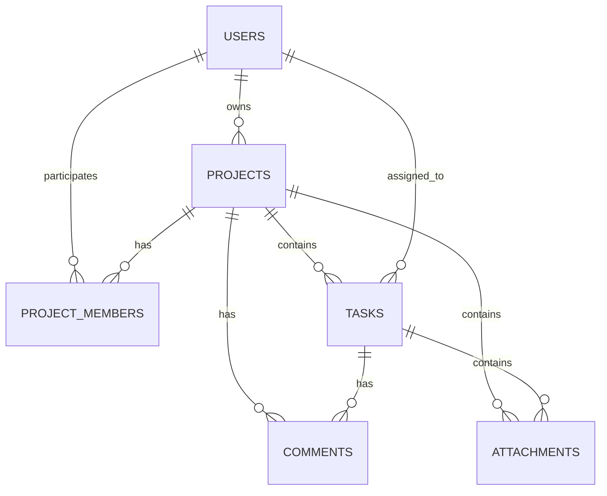

# AI-Dev-Commander - Product Requirements Document

**Versão:** 1.0  
**Data:** 17/02/2026

---

## 1. Resumo Executivo

# AI-Dev-Commander - Product Requirements Document

## Resumo Executivo

AI-Dev-Commander é uma solução projetada para Cria e faz a gestão de agentes virtuais especializados em partes do desenvolvimento de sistemas. Equipes de projeto têm dificuldade em acompanhar tarefas, prazos e responsabilidades em tempo real, res...

### Problema
Cria e faz a gestão de agentes virtuais especializados em partes do desenvolvimento de sistemas. Equipes de projeto têm dificuldade em acompanhar tarefas, prazos e responsabilidades em tempo real, resultando em atrasos e comunicação fragmentada.

### Solução Proposta
O AI-Dev-Commander aborda este problema através de Cria backups de todos os arquivos "vitais" dos agentes promovendo persistência de memória.
Automação inteligente de priorização com IA que aprende padrões da equipe e sugere otimizações.

### Público-Alvo
Profissionais de senior, ensino superior completo, renda média-alta, localizados em grandes centros urbanos.

### Proposta de Valor
Reduza em 80% o tempo de gestão de tarefas com priorização automática e integração nativa com seu fluxo de desenvolvimento.

### Modelo de Negócio
freemium - Gratuito para até 15 usuários com funcionalidades básicas. Planos pagos a partir de R$ 49/usuário/mês com automação avançada, relatórios e integrações ilimitadas. Enterprise com SSO e suporte dedicado.

---

## 2. Arquitetura de Banco de Dados

### 2.1 Diagrama ER



### 2.2 Tabelas

#### users

| Campo | Tipo | Constraints |
|-------|------|-------------|
| id | UUID | PRIMARY KEY |
| email | VARCHAR(255) | UNIQUE, NOT NULL |
| password_hash | VARCHAR(255) | NOT NULL |
| first_name | VARCHAR(100) | NOT NULL |
| last_name | VARCHAR(100) | NOT NULL |
| role | VARCHAR(50) | DEFAULT user |
| created_at | TIMESTAMP | DEFAULT CURRENT_TIMESTAMP |

#### projects

| Campo | Tipo | Constraints |
|-------|------|-------------|
| id | UUID | PRIMARY KEY |
| name | VARCHAR(255) | NOT NULL |
| description | TEXT |  |
| status | VARCHAR(50) | DEFAULT active |
| owner_id | UUID | FOREIGN KEY |
| created_at | TIMESTAMP | DEFAULT CURRENT_TIMESTAMP |

#### tasks

| Campo | Tipo | Constraints |
|-------|------|-------------|
| id | UUID | PRIMARY KEY |
| title | VARCHAR(255) | NOT NULL |
| description | TEXT |  |
| status | VARCHAR(50) | DEFAULT todo |
| priority | VARCHAR(20) | DEFAULT medium |
| project_id | UUID | FOREIGN KEY, NOT NULL |
| assignee_id | UUID | FOREIGN KEY |
| due_date | TIMESTAMP |  |
| created_at | TIMESTAMP | DEFAULT CURRENT_TIMESTAMP |


### 2.3 Relacionamentos

- **users** 1:N **projects**: Um usuário pode ser dono de múltiplos projetos
- **projects** 1:N **tasks**: Um projeto contém múltiplas tarefas
- **users** 1:N **tasks**: Um usuário pode ter múltiplas tarefas atribuídas

### 2.4 Estratégia de Normalização

O schema segue a 3ª Forma Normal (3NF):

1. **1NF**: Todas as colunas contêm valores atômicos (indivisíveis)
2. **2NF**: Todas as colunas não-chave dependem completamente da chave primária
3. **3NF**: Não há dependências transitivas entre colunas não-chave

**Estratégias adicionais**:
- Uso de JSONB para campos flexíveis (metadata, data em notificações)
- Separação de entidades em tabelas distintas para evitar redundância
- Foreign keys para manter integridade referencial
- Índices estratégicos para performance de queries frequentes

---

## 3. Especificação de Features

### 3.1 User Stories

#### a2n62e0jo
**Como** usuário, **quero** utilizar Dashboard de Tarefas **para** Visualização Kanban e lista com filtros avançados.

**Critérios de Aceitação:**
- O sistema deve permitir acessar Dashboard de Tarefas
- A funcionalidade deve estar disponível na interface principal
- O usuário recebe feedback visual das ações realizadas

#### mxq51vzzl
**Como** usuário, **quero** utilizar Automação de Priorização **para** IA que sugere prioridades baseadas em prazos e dependências.

**Critérios de Aceitação:**
- O sistema deve permitir acessar Automação de Priorização
- A funcionalidade deve estar disponível na interface principal
- O usuário recebe feedback visual das ações realizadas

#### fb0j9qu6j
**Como** usuário, **quero** utilizar Integração Git **para** Sincronização automática com commits e pull requests.

**Critérios de Aceitação:**
- O sistema deve permitir acessar Integração Git
- A funcionalidade deve estar disponível na interface principal
- O usuário recebe feedback visual das ações realizadas

#### bcgn5kd51
**Como** usuário, **quero** utilizar Relatórios Avançados **para** Análise de produtividade e previsões de entrega.

**Critérios de Aceitação:**
- O sistema deve permitir acessar Relatórios Avançados
- A funcionalidade deve estar disponível na interface principal
- O usuário recebe feedback visual das ações realizadas

#### 9gn87e4tw
**Como** usuário, **quero** utilizar Time Tracking **para** Registro automático de tempo gasto em tarefas.

**Critérios de Aceitação:**
- O sistema deve permitir acessar Time Tracking
- A funcionalidade deve estar disponível na interface principal
- O usuário recebe feedback visual das ações realizadas

#### 5j686quxf
**Como** usuário, **quero** utilizar Agentes **para** CRUD que faz a gestão completa da "vida" dos agentes OpenClaw.

🧠 A VIDA DE UM AGENTE OPENCLAW

Um agente OpenClaw não é só código.

Ele é sustentado por um conjunto de .md que representam:

Identidade

Memória

Estado

Trabalho

Regras

Continuidade

Esses arquivos compõem a vida operacional do agente.

🔴 NÚCLEO VITAL (Sem eles o agente “perde a alma”)
1️⃣ SOUL.md

Identidade profunda

Contém:

valores

personalidade

tom

princípios

limites

autonomia

como decide

o que nunca faz

É o DNA do agente.

Se perder:
→ ele vira genérico.

2️⃣ SYSTEM.md

Arquitetura e governança

Contém:

regras operacionais

hierarquia

como interage com outros agentes

protocolos de segurança

políticas de PR/commit

É a constituição.

3️⃣ AGENTS.md

Mapa da equipe

Contém:

lista de agentes

papéis

responsabilidades

permissões

Sem ele:
→ o ecossistema perde organização.

🟠 MEMÓRIA E CONTINUIDADE (Vida ativa)
4️⃣ MEMORY.md

Memória ativa

Contém:

decisões recentes

aprendizados

contexto acumulado

fatos importantes

É o cérebro de curto/médio prazo.

Extremamente crítico.

5️⃣ CONTEXT.md

Foco atual

Contém:

objetivo atual

prioridade do momento

restrições

instruções recentes

É o “estado mental atual”.

6️⃣ TASKS.md

Trabalho vivo

Contém:

backlog

em execução

bloqueadas

concluídas

É o fluxo de vida produtiva.

🟡 ESTADO E MONITORAMENTO
7️⃣ HEARTBEAT.md

Sinais vitais

Contém:

última execução

agentes ativos

saúde

checkpoints

Permite recuperação automática.

🟢 CAMADA DE EVOLUÇÃO (Profissional)

Esses aparecem em workstations maduras:

8️⃣ DECISIONS.md

Registro histórico de decisões importantes.

9️⃣ LESSONS.md

Aprendizados consolidados.

🔟 LOG.md

Log humano resumido (não técnico).

11️⃣ SESSION.md

Resumo da sessão atual.

12️⃣ PENDING.md

Pendências estratégicas.

🧬 Como esses arquivos interagem
SOUL → define comportamento
SYSTEM → define regras
AGENTS → define papéis
MEMORY → mantém continuidade
CONTEXT → define foco atual
TASKS → define ação
HEARTBEAT → mantém vida

🧠 Se você quer preservar a “vida”

Os arquivos absolutamente críticos são:

SOUL.md
SYSTEM.md
AGENTS.md
MEMORY.md
TASKS.md
CONTEXT.md
HEARTBEAT.md


Se qualquer um desses corromper:
→ o agente perde continuidade.

🔥 Hierarquia de criticidade
🔴 Crítico máximo

SOUL.md

MEMORY.md

SYSTEM.md

🟠 Muito importante

TASKS.md

AGENTS.md

🟡 Operacional

CONTEXT.md

HEARTBEAT.md

🧠 Conclusão

A “vida” de um agente OpenClaw é sustentada por:

Identidade + Memória + Regras + Trabalho + Estado

Representados por esses .md.

.

**Critérios de Aceitação:**
- O sistema deve permitir acessar Agentes
- A funcionalidade deve estar disponível na interface principal
- O usuário recebe feedback visual das ações realizadas


### 3.2 Casos de Uso

#### Criação de Projeto
- **Ator:** Usuário autenticado
- **Pré-condições:** Usuário está logado no sistema, Usuário tem permissões adequadas
- **Pós-condições:** Fluxo Criação de Projeto é concluído com sucesso

**Fluxo Principal:**
1. Usuário clica em "Novo Projeto"
2. Preenche nome e descrição
3. Seleciona template ou começa do zero
4. Convida membros por email
5. Configura permissões

#### Criação e Atribuição de Tarefa
- **Ator:** Usuário autenticado
- **Pré-condições:** Usuário está logado no sistema, Usuário tem permissões adequadas
- **Pós-condições:** Fluxo Criação e Atribuição de Tarefa é concluído com sucesso

**Fluxo Principal:**
1. Usuário clica em "Nova Tarefa"
2. Preenche título, descrição e critérios de aceitação
3. Define prioridade e prazo
4. Atribui a membros da equipe
5. Adiciona labels e dependências
6. Sistema notifica responsáveis

#### Acompanhamento de Progresso
- **Ator:** Usuário autenticado
- **Pré-condições:** Usuário está logado no sistema, Usuário tem permissões adequadas
- **Pós-condições:** Fluxo Acompanhamento de Progresso é concluído com sucesso

**Fluxo Principal:**
1. Usuário acessa dashboard
2. Visualiza tarefas atribuídas
3. Atualiza status (To Do → In Progress → Done)
4. Sistema registra tempo automaticamente
5. Atualiza métricas do projeto

#### Monitoramento
- **Ator:** Usuário autenticado
- **Pré-condições:** Usuário está logado no sistema, Usuário tem permissões adequadas
- **Pós-condições:** Fluxo Monitoramento é concluído com sucesso

**Fluxo Principal:**
1. 1 - Usuário clica
2. 2 - Dashboard de monitoramento com tarefas e status por agente. Mostra como está a execução das tarefas: Ok ( se estiverem dentro do prazo), Atrasado ou Adiantado
3. 3 - Botão "Gerar Relatorio de Status" gera um report com a posição do dia com tudo que esta atrasado ou por fazer no dia
4. 4 - Botão "Medir Eficiencia" atribui pontos por : pontualidade de entrega, assertividade, segurança e aprendizado
5. Qualifica os que vao bem para promoção e para cair de função se for mal


### 3.3 Requisitos Não-Funcionais

- Performance: Tempo de resposta < 200ms para operações CRUD. Suporte a 10.000 usuários simultâneos. 99.9% uptime.
- Disponibilidade: 99.9% uptime
- Segurança: Dados sensíveis criptografados em repouso e em trânsito
- Escalabilidade: Suporte a crescimento de 10x em 12 meses
- Usabilidade: Onboarding em menos de 5 minutos
- Compatibilidade: web, ios, android, desktop

---

## 4. Design de Interface

### 4.1 Telas

#### Dashboard Principal (/dashboard)

Visão geral de projetos e tarefas do usuário

**Elementos:** Header com navegação, Sidebar com menu, Cards de estatísticas, Lista de tarefas recentes, Gráficos de progresso

**Wireframe:**
```

+------------------------------------------+
|  LOGO    Dashboard  Projetos  Perfil    |
+------------------------------------------+
|  +--------+  +--------+  +--------+     |
|  | Projetos|  | Tarefas |  | Concluídas||
|  |   12    |  |   45   |  |    28    |  |
|  +--------+  +--------+  +--------+     |
|                                         |
|  +----------------------------------+   |
|  | Minhas Tarefas                   |   |
|  | [ ] Tarefa 1 - Alta prioridade   |   |
|  | [x] Tarefa 2 - Concluída         |   |
|  | [ ] Tarefa 3 - Em progresso      |   |
|  +----------------------------------+   |
|                                         |
|  +----------------------------------+   |
|  | Progresso do Projeto             |   |
|  | [████████░░░░░░░░░░] 45%         |   |
|  +----------------------------------+   |
+------------------------------------------+
          
```

#### Lista de Projetos (/projects)

Visualização e gerenciamento de projetos

**Elementos:** Barra de busca, Filtros, Grid/Lista de projetos, Botão novo projeto, Cards de projeto

**Wireframe:**
```

+------------------------------------------+
|  Projetos                    [+ Novo]   |
+------------------------------------------+
|  [Buscar...] [Status ▼] [Data ▼]       |
+------------------------------------------+
|  +------------+  +------------+         |
|  | Projeto A  |  | Projeto B  |         |
|  | Ativo      |  | Em pausa   |         |
|  | 12 tarefas |  | 8 tarefas  |         |
|  | [Ver] [Edit]|  | [Ver] [Edit]|        |
|  +------------+  +------------+         |
|  +------------+  +------------+         |
|  | Projeto C  |  | Projeto D  |         |
|  | Concluído  |  | Ativo      |         |
|  | 25 tarefas |  | 15 tarefas |         |
|  +------------+  +------------+         |
+------------------------------------------+
          
```

#### Detalhes da Tarefa (/tasks/:id)

Visualização completa de uma tarefa

**Elementos:** Título editável, Descrição, Status e prioridade, Responsável, Prazo, Comentários, Anexos, Histórico

**Wireframe:**
```

+------------------------------------------+
|  ← Voltar  |  Tarefa #123    [Ações ▼] |
+------------------------------------------+
|  Implementar feature de login            |
|  [Em Progresso] [Alta] [Editar]         |
+------------------------------------------+
|  Descrição:                              |
|  Criar sistema de autenticação com JWT  |
|  e refresh tokens...                      |
|                                          |
|  Responsável: @joao.silva               |
|  Prazo: 15/03/2024                      |
|  Estimativa: 8 horas                    |
+------------------------------------------+
|  Comentários                    [+ Add] |
|  ─────────────────────────────────────  |
|  @maria: Revisado o design!            |
|  Há 2 horas                             |
|  ─────────────────────────────────────  |
|  @joao: Iniciando implementação        |
|  Ontem                                  |
+------------------------------------------+
          
```


### 4.2 Componentes Reutilizáveis

- **Button** (Atom): variant: primary | secondary | danger | ghost, size: sm | md | lg, disabled: boolean, loading: boolean, onClick: () => void
- **Card** (Molecule): title: string, children: ReactNode, footer?: ReactNode, onClick?: () => void
- **TaskItem** (Organism): task: Task, onStatusChange: (status) => void, onClick: () => void, showAssignee: boolean
- **Modal** (Molecule): isOpen: boolean, onClose: () => void, title: string, children: ReactNode, size: sm | md | lg | xl
- **DataTable** (Organism): data: T[], columns: Column[], onSort: (column) => void, onFilter: (filters) => void, pagination: PaginationConfig

---

## 5. Especificação de Forms

### Criação de Projeto

| Campo | Tipo | Obrigatório | Label |
|-------|------|-------------|-------|
| name | text | Sim | Nome do Projeto |
| description | textarea | Não | Descrição |
| startDate | date | Não | Data de Início |
| endDate | date | Não | Data de Término |
| template | select | Não | Template |

**Comportamento:** Ao submeter, o projeto é criado e o usuário é redirecionado para a página do projeto. Em caso de erro, mensagens são exibidas inline.

### Criação de Tarefa

| Campo | Tipo | Obrigatório | Label |
|-------|------|-------------|-------|
| title | text | Sim | Título |
| description | textarea | Não | Descrição |
| priority | select | Sim | Prioridade |
| assignee | select | Não | Responsável |
| dueDate | date | Não | Prazo |
| estimatedHours | number | Não | Horas Estimadas |

**Comportamento:** A tarefa é criada e notificações são enviadas ao responsável. O modal fecha e a lista de tarefas é atualizada.

### Edição de Perfil

| Campo | Tipo | Obrigatório | Label |
|-------|------|-------------|-------|
| firstName | text | Sim | Nome |
| lastName | text | Sim | Sobrenome |
| email | email | Sim | Email |
| avatar | file | Não | Foto de Perfil |
| bio | textarea | Não | Biografia |

**Comportamento:** Perfil atualizado com mensagem de sucesso. Em caso de erro de email duplicado, mensagem específica é exibida.


---

## 6. Operações CRUD

### 6.1 Endpoints

#### GET /api/projects

Lista todos os projetos do usuário

- **Permissões:** authenticated
- **Lógica:** Retorna projetos onde o usuário é membro ou dono. Suporta paginação, filtros e ordenação.
- **Erros:** 401: Não autenticado, 403: Sem permissão, 500: Erro interno

#### POST /api/projects

Cria um novo projeto

- **Permissões:** authenticated
- **Lógica:** Valida dados, cria projeto, adiciona usuário como dono e membro, envia notificação.
- **Erros:** 400: Dados inválidos, 409: Nome duplicado, 401: Não autenticado

#### GET /api/projects/:id

Obtém detalhes de um projeto

- **Permissões:** project:member
- **Lógica:** Verifica se usuário tem acesso ao projeto. Retorna dados completos incluindo estatísticas.
- **Erros:** 404: Projeto não encontrado, 403: Sem acesso, 401: Não autenticado

#### PUT /api/projects/:id

Atualiza um projeto

- **Permissões:** project:owner
- **Lógica:** Valida permissões, atualiza dados, registra atividade, notifica membros.
- **Erros:** 400: Dados inválidos, 403: Sem permissão, 404: Projeto não encontrado

#### DELETE /api/projects/:id

Remove um projeto

- **Permissões:** project:owner
- **Lógica:** Soft delete. Marca projeto como removido, mantém dados para histórico. Notifica membros.
- **Erros:** 403: Apenas dono pode remover, 404: Projeto não encontrado, 409: Projeto tem dados vinculados

#### GET /api/tasks

Lista tarefas de um projeto

- **Permissões:** project:member
- **Lógica:** Filtra por projeto, status, responsável. Suporta busca full-text.
- **Erros:** 400: Filtros inválidos, 403: Sem acesso ao projeto, 401: Não autenticado

#### POST /api/tasks

Cria uma nova tarefa

- **Permissões:** project:member
- **Lógica:** Valida dados, cria tarefa, notifica responsável, atualiza contadores do projeto.
- **Erros:** 400: Dados inválidos, 404: Projeto não encontrado, 404: Responsável não encontrado

#### PATCH /api/tasks/:id

Atualiza parcialmente uma tarefa

- **Permissões:** project:member
- **Lógica:** Permite atualização parcial. Registra mudanças no histórico. Notifica envolvidos.
- **Erros:** 400: Dados inválidos, 403: Sem permissão, 404: Tarefa não encontrada

#### POST /api/auth/login

Autentica um usuário

- **Permissões:** public
- **Lógica:** Valida credenciais, gera JWT, registra login, verifica MFA se habilitado.
- **Erros:** 400: Credenciais inválidas, 401: Senha incorreta, 403: Conta bloqueada, 423: MFA necessário

#### POST /api/auth/register

Registra um novo usuário

- **Permissões:** public
- **Lógica:** Valida dados, hash da senha, cria usuário, envia email de verificação.
- **Erros:** 400: Dados inválidos, 409: Email já cadastrado, 422: Senha fraca


---

## 7. Workflows

### 7.1 Automatizados

#### Notificação de Nova Tarefa
Envia notificação quando uma tarefa é atribuída

1. Tarefa criada com responsável
2. Criar notificação no banco
3. Enviar email push
4. Enviar notificação push (se habilitado)

**Triggers:** Tarefa criada com assignee, Tarefa reatribuída

#### Geração de Relatório Semanal
Gera e envia relatório de produtividade toda segunda

1. Agendador dispara às 9h de segunda
2. Coletar dados da semana anterior
3. Gerar PDF do relatório
4. Enviar email para gestores

**Triggers:** Cron: 0 9 * * 1

#### Backup Diário
Realiza backup automático do banco de dados

1. Agendador dispara às 2h
2. Criar dump do banco
3. Compactar e criptografar
4. Upload para S3
5. Verificar integridade
6. Notificar admin em caso de falha

**Triggers:** Cron: 0 2 * * *


### 7.2 Notificações

- **Nova Tarefa Atribuída** (Email + In-app + Push): Olá {{name}}, você foi designado para a tarefa "{{taskTitle}}" no projeto "{{projectName}}". Prazo: {{dueDate}}
- **Prazo Próximo** (Email + In-app): A tarefa "{{taskTitle}}" vence em 24 horas. Clique para visualizar.
- **Tarefa Concluída** (In-app): {{userName}} completou a tarefa "{{taskTitle}}"
- **Novo Comentário** (Email + In-app): {{userName}} comentou em "{{taskTitle}}": "{{commentPreview}}"

---

## 8. Documentação Técnica

### 8.1 Stack Tecnológico

**frontend:** React 18+ com TypeScript, Next.js 14 (App Router), Tailwind CSS para estilização, shadcn/ui para componentes, TanStack Query para state management, Zustand para estado global, React Hook Form + Zod para formulários

**mobile:** React Native com Expo, TypeScript, React Navigation, React Native Paper para UI, AsyncStorage para cache local

**backend:** Node.js com Express ou NestJS, TypeScript, PostgreSQL como banco principal, Redis para cache e sessões, Prisma ORM para acesso a dados, Socket.io para realtime (se necessário)

**database:** PostgreSQL 15+, Redis 7+, Elasticsearch para busca

**infrastructure:** Docker para containerização, AWS/GCP/Azure para cloud, Vercel para frontend, GitHub Actions para CI/CD, Prometheus + Grafana para monitoramento

**tools:** Git + GitHub para versionamento, Figma para design, Jest + React Testing Library para testes, Cypress/Playwright para E2E, ESLint + Prettier para qualidade de código

### 8.2 Arquitetura

## Arquitetura do Sistema

### Visão Geral
O AI-Dev-Commander segue uma arquitetura em camadas com separação clara entre frontend, backend e infraestrutura.

### Padrão Arquitetural
**Clean Architecture + Domain-Driven Design**

- **Domain Layer**: Entidades, value objects, regras de negócio
- **Application Layer**: Casos de uso, serviços de aplicação
- **Infrastructure Layer**: Banco de dados, APIs externas, filas
- **Presentation Layer**: Controllers, middlewares, DTOs

### Fluxo de Dados
1. Cliente faz requisição HTTP/REST ou WebSocket
2. API Gateway/Load Balancer direciona
3. Controller valida e delega para Service
4. Service executa lógica de negócio
5. Repository acessa banco de dados
6. Resposta retorna pelo caminho inverso

### Componentes Principais
- **API Server**: Node.js com Express/NestJS
- **Database**: PostgreSQL (primário) + Redis (cache)
- **Queue**: Redis/Bull para jobs assíncronos
- **Storage**: AWS S3 para arquivos
- **Search**: Elasticsearch (se necessário)
- **Realtime**: Socket.io para WebSockets

### Escalabilidade
- Horizontal scaling com load balancer
- Database read replicas
- CDN para assets estáticos
- Microservices para funcionalidades críticas (futuro)

### 8.3 Infraestrutura

- **Hosting:** AWS/GCP com Docker containers em ECS/GKE
- **Scaling:** Auto-scaling baseado em CPU/memory (70% threshold). Mínimo 2 instâncias, máximo 20.
- **Monitoramento:** Prometheus + Grafana para métricas. DataDog para APM. PagerDuty para alertas críticos.
- **Backup:** Backup diário automático do PostgreSQL (retenção 30 dias). Snapshots S3 com versioning.

---

## 9. Schema SQL

```sql
-- Schema SQL para AI-Dev-Commander
-- Gerado automaticamente pelo bestPRD

-- Extensões necessárias
CREATE EXTENSION IF NOT EXISTS "uuid-ossp";
CREATE EXTENSION IF NOT EXISTS "pgcrypto";

-- Tabela de Usuários
CREATE TABLE users (
    id UUID PRIMARY KEY DEFAULT uuid_generate_v4(),
    email VARCHAR(255) UNIQUE NOT NULL,
    password_hash VARCHAR(255) NOT NULL,
    first_name VARCHAR(100) NOT NULL,
    last_name VARCHAR(100) NOT NULL,
    avatar_url VARCHAR(500),
    role VARCHAR(50) DEFAULT 'user',
    email_verified BOOLEAN DEFAULT FALSE,
    mfa_enabled BOOLEAN DEFAULT FALSE,
    last_login_at TIMESTAMP,
    created_at TIMESTAMP DEFAULT CURRENT_TIMESTAMP,
    updated_at TIMESTAMP DEFAULT CURRENT_TIMESTAMP,
    is_active BOOLEAN DEFAULT TRUE
);

CREATE INDEX idx_users_email ON users(email);
CREATE INDEX idx_users_role ON users(role);

-- Tabela de Projetos
CREATE TABLE projects (
    id UUID PRIMARY KEY DEFAULT uuid_generate_v4(),
    name VARCHAR(255) NOT NULL,
    description TEXT,
    status VARCHAR(50) DEFAULT 'active',
    owner_id UUID REFERENCES users(id),
    start_date DATE,
    end_date DATE,
    created_at TIMESTAMP DEFAULT CURRENT_TIMESTAMP,
    updated_at TIMESTAMP DEFAULT CURRENT_TIMESTAMP
);

CREATE INDEX idx_projects_owner ON projects(owner_id);
CREATE INDEX idx_projects_status ON projects(status);

-- Tabela de Membros do Projeto
CREATE TABLE project_members (
    id UUID PRIMARY KEY DEFAULT uuid_generate_v4(),
    project_id UUID REFERENCES projects(id) ON DELETE CASCADE,
    user_id UUID REFERENCES users(id) ON DELETE CASCADE,
    role VARCHAR(50) DEFAULT 'member',
    joined_at TIMESTAMP DEFAULT CURRENT_TIMESTAMP,
    UNIQUE(project_id, user_id)
);

CREATE INDEX idx_project_members_project ON project_members(project_id);
CREATE INDEX idx_project_members_user ON project_members(user_id);

-- Tabela de Tarefas
CREATE TABLE tasks (
    id UUID PRIMARY KEY DEFAULT uuid_generate_v4(),
    title VARCHAR(255) NOT NULL,
    description TEXT,
    status VARCHAR(50) DEFAULT 'todo',
    priority VARCHAR(20) DEFAULT 'medium',
    project_id UUID REFERENCES projects(id) ON DELETE CASCADE,
    assignee_id UUID REFERENCES users(id),
    creator_id UUID REFERENCES users(id),
    due_date TIMESTAMP,
    completed_at TIMESTAMP,
    estimated_hours INTEGER,
    actual_hours INTEGER,
    created_at TIMESTAMP DEFAULT CURRENT_TIMESTAMP,
    updated_at TIMESTAMP DEFAULT CURRENT_TIMESTAMP
);

CREATE INDEX idx_tasks_project ON tasks(project_id);
CREATE INDEX idx_tasks_assignee ON tasks(assignee_id);
CREATE INDEX idx_tasks_status ON tasks(status);
CREATE INDEX idx_tasks_priority ON tasks(priority);
CREATE INDEX idx_tasks_due_date ON tasks(due_date);

-- Tabela de Comentários
CREATE TABLE comments (
    id UUID PRIMARY KEY DEFAULT uuid_generate_v4(),
    content TEXT NOT NULL,
    author_id UUID REFERENCES users(id),
    project_id UUID REFERENCES projects(id) ON DELETE CASCADE,
    task_id UUID REFERENCES tasks(id) ON DELETE CASCADE,
    parent_id UUID REFERENCES comments(id) ON DELETE CASCADE,
    created_at TIMESTAMP DEFAULT CURRENT_TIMESTAMP,
    updated_at TIMESTAMP DEFAULT CURRENT_TIMESTAMP
);

CREATE INDEX idx_comments_project ON comments(project_id);
CREATE INDEX idx_comments_task ON comments(task_id);
CREATE INDEX idx_comments_author ON comments(author_id);

-- Tabela de Anexos
CREATE TABLE attachments (
    id UUID PRIMARY KEY DEFAULT uuid_generate_v4(),
    filename VARCHAR(255) NOT NULL,
    original_name VARCHAR(255) NOT NULL,
    mime_type VARCHAR(100) NOT NULL,
    size_bytes BIGINT NOT NULL,
    url VARCHAR(500) NOT NULL,
    uploader_id UUID REFERENCES users(id),
    project_id UUID REFERENCES projects(id) ON DELETE CASCADE,
    task_id UUID REFERENCES tasks(id) ON DELETE SET NULL,
    created_at TIMESTAMP DEFAULT CURRENT_TIMESTAMP
);

CREATE INDEX idx_attachments_project ON attachments(project_id);
CREATE INDEX idx_attachments_task ON attachments(task_id);
CREATE INDEX idx_attachments_uploader ON attachments(uploader_id);

-- Tabela de Notificações
CREATE TABLE notifications (
    id UUID PRIMARY KEY DEFAULT uuid_generate_v4(),
    user_id UUID REFERENCES users(id) ON DELETE CASCADE,
    type VARCHAR(100) NOT NULL,
    title VARCHAR(255) NOT NULL,
    message TEXT,
    data JSONB,
    read_at TIMESTAMP,
    created_at TIMESTAMP DEFAULT CURRENT_TIMESTAMP
);

CREATE INDEX idx_notifications_user ON notifications(user_id);
CREATE INDEX idx_notifications_read ON notifications(read_at) WHERE read_at IS NULL;
CREATE INDEX idx_notifications_created ON notifications(created_at);

-- Tabela de Atividades (Audit Log)
CREATE TABLE activities (
    id UUID PRIMARY KEY DEFAULT uuid_generate_v4(),
    actor_id UUID REFERENCES users(id),
    action VARCHAR(100) NOT NULL,
    entity_type VARCHAR(100) NOT NULL,
    entity_id UUID NOT NULL,
    project_id UUID REFERENCES projects(id) ON DELETE CASCADE,
    metadata JSONB,
    ip_address INET,
    user_agent TEXT,
    created_at TIMESTAMP DEFAULT CURRENT_TIMESTAMP
);

CREATE INDEX idxactivities_project ON activities(project_id);
CREATE INDEX idx_activities_entity ON activities(entity_type, entity_id);
CREATE INDEX idx_activities_created ON activities(created_at);

-- Trigger para atualizar updated_at automaticamente
CREATE OR REPLACE FUNCTION update_updated_at_column()
RETURNS TRIGGER AS $$
BEGIN
    NEW.updated_at = CURRENT_TIMESTAMP;
    RETURN NEW;
END;
$$ language 'plpgsql';

CREATE TRIGGER update_users_updated_at BEFORE UPDATE ON users
    FOR EACH ROW EXECUTE FUNCTION update_updated_at_column();

CREATE TRIGGER update_projects_updated_at BEFORE UPDATE ON projects
    FOR EACH ROW EXECUTE FUNCTION update_updated_at_column();

CREATE TRIGGER update_tasks_updated_at BEFORE UPDATE ON tasks
    FOR EACH ROW EXECUTE FUNCTION update_updated_at_column();

CREATE TRIGGER update_comments_updated_at BEFORE UPDATE ON comments
    FOR EACH ROW EXECUTE FUNCTION update_updated_at_column();

```

---

## 10. Especificação de Telas

### 10.1 Lista de Telas

#### Login/Autenticação

**Objetivo:** Permitir que usuários acessem o sistema

**Elementos:**
- Formulário de email e senha
- Botão de login
- Link para recuperação de senha
- Opção de login social (Google, GitHub)
- Link para registro de nova conta

#### Dashboard Principal

**Objetivo:** Fornecer visão geral das atividades e métricas

**Elementos:**
- Cards com estatísticas principais
- Lista de tarefas pendentes
- Gráficos de progresso
- Ações rápidas
- Notificações recentes

#### Listagem de Projetos

**Objetivo:** Gerenciar e visualizar todos os projetos

**Elementos:**
- Barra de busca
- Filtros (status, data, responsável)
- Grid/Lista de projetos
- Botão para novo projeto
- Paginação

#### Detalhes do Projeto

**Objetivo:** Visualizar e gerenciar um projeto específico

**Elementos:**
- Informações do projeto
- Lista de tarefas
- Membros do projeto
- Atividades recentes
- Configurações do projeto

#### Criação/Edição de Tarefa

**Objetivo:** Criar ou modificar uma tarefa

**Elementos:**
- Título da tarefa
- Descrição
- Seleção de prioridade
- Seleção de responsável
- Data de prazo
- Anexos
- Botões salvar/cancelar

#### Perfil do Usuário

**Objetivo:** Gerenciar informações pessoais

**Elementos:**
- Foto de perfil
- Dados pessoais (nome, email)
- Alteração de senha
- Preferências
- Histórico de atividades

#### Configurações

**Objetivo:** Configurar preferências do sistema

**Elementos:**
- Tema (claro/escuro)
- Notificações
- Integrações
- Configurações de conta
- Exportar dados

#### Criação de Projeto

**Objetivo:** Fluxo para criar um novo projeto e convidar membros

**Elementos:**
- Usuário clica em "Novo Projeto"
- Preenche nome e descrição
- Seleciona template ou começa do zero
- Convida membros por email
- Configura permissões

#### Criação e Atribuição de Tarefa

**Objetivo:** Fluxo completo de criação de tarefa

**Elementos:**
- Usuário clica em "Nova Tarefa"
- Preenche título, descrição e critérios de aceitação
- Define prioridade e prazo
- Atribui a membros da equipe
- Adiciona labels e dependências
- Sistema notifica responsáveis

#### Acompanhamento de Progresso

**Objetivo:** Visualização e atualização de status

**Elementos:**
- Usuário acessa dashboard
- Visualiza tarefas atribuídas
- Atualiza status (To Do → In Progress → Done)
- Sistema registra tempo automaticamente
- Atualiza métricas do projeto

#### Monitoramento

**Objetivo:** Monitora a eficiencia dos agentes

**Elementos:**
- 1 - Usuário clica
- 2 - Dashboard de monitoramento com tarefas e status por agente. Mostra como está a execução das tarefas: Ok ( se estiverem dentro do prazo), Atrasado ou Adiantado
- 3 - Botão "Gerar Relatorio de Status" gera um report com a posição do dia com tudo que esta atrasado ou por fazer no dia
- 4 - Botão "Medir Eficiencia" atribui pontos por : pontualidade de entrega, assertividade, segurança e aprendizado
- Qualifica os que vao bem para promoção e para cair de função se for mal


### 10.2 Fluxos de Navegação

- **Login** → **Dashboard**: Autenticação bem-sucedida
- **Dashboard** → **Listagem de Projetos**: Clique em "Projetos"
- **Listagem de Projetos** → **Detalhes do Projeto**: Clique em um projeto
- **Detalhes do Projeto** → **Criação de Tarefa**: Clique em "Nova Tarefa"
- **Dashboard** → **Perfil**: Clique no avatar
- **Perfil** → **Configurações**: Clique em "Configurações"
- **Qualquer tela** → **Login**: Logout

---

*Documento gerado automaticamente pelo bestPRD*
